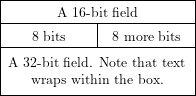

# Insert Image from Latex

This [Zim](https://github.com/zim-desktop-wiki/zim-desktop-wiki "Zim - A Desktop Wiki Editor") plugin allows you to insert various images into a page, as long as [LaTeX](https://www.latex-project.org/ "LaTeX – A document preparation system") scripts can be converted to these images. In other words, this Zim plugin will enable you to insert LaTeX scripts into a page but showing as an image.

# Backgroud (TL;DR)

At first, I want to insert an illustration exported from LaTeX scripts using the [bytefield](https://ctan.org/pkg/bytefield?lang=en "bytefield – Create illustrations for network protocol specifications") package. So I need to copy the Insert Equation plugin, make some changes, and then add the Template file as the Insert Equation plugin does. 

But after that, I start thinking about what should I do if I want to insert an  illustration exported with other LaTeX  
packages.

So, here we go. I remove the template, make some changes, and then we get this plugin. We can now write any LaTeX scripts (I guess) and show them as a PNG image in pages.

On the other hand, this plugin could replace the Insert Equation plugin if you are familiar with the LaTeX syntax.

# Installation 

```bash
# step 1 - install dependencies
apt-get install latex divpng

# step 2 - install this plugin
git clone http://this/repo.git ~/.local/share/zim/plugins/insert_latex/

# step 3 - restart Zim to load this plugin

# step 4 - enable this plugin
# In Edit > Preferences > Plugins tab, you can now tick Insert Image form LaTeX.

```

# Example 

## LaTeX bytefield 

With the following LaTeX scripts:
```latex
\documentclass[14pt]{article}
\pagestyle{empty}
\usepackage{bytefield}

\begin{document}
    \begin{center}
        \begin{bytefield}{16}
            \wordbox{1}{A 16-bit field} \\
            \bitbox{8}{8 bits} & \bitbox{8}{8 more bits} \\
            \wordbox{2}{A 32-bit field. Note that text wraps within the box.}
        \end{bytefield}
    \end{center}
\end{document}
```

you can get this in zim pages:



TIPS: The `\pagestyle{empty}`, Produces empty heads and feet, makes the output image fit the content's size. It's quite useful.

